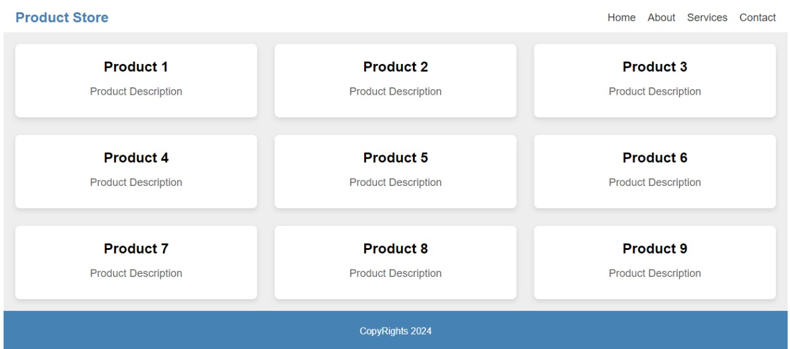

# Product Store Interface

This project is a dynamically generated product store interface built entirely using **JavaScript**. It creates product cards and organizes them in a responsive grid layout.

## Features:
- **Responsive Grid Layout**: Automatically adjusts to different screen sizes.
- **Dynamically Created Elements**: All products, header, and footer are generated using JavaScript.
- **Modern Design**: Clean and minimalist UI with smooth shadows and padding.
  
## How to Run the Project:
1. Clone or download the repository.
2. Open the `index.html` file in any modern browser.
3. The product store interface will automatically display with 15 sample products.

## Technologies Used:
- HTML5
- JavaScript (DOM Manipulation)
- CSS (embedded within JS)

## Preview:

